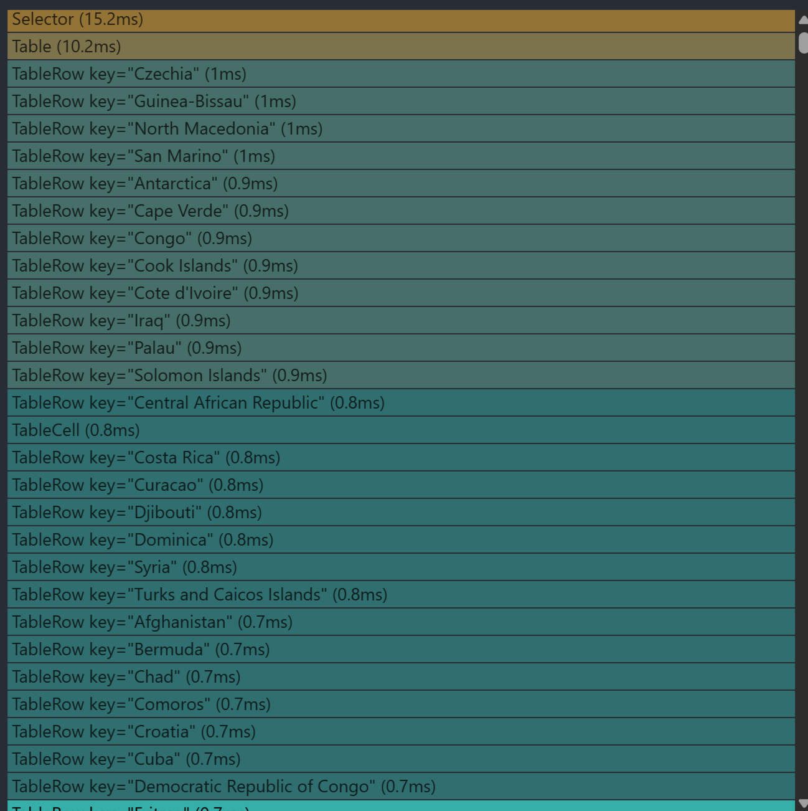

# First render (before receiving the data)

| Before  | After  | 
|:-------|:-------:|
|  |  |
| **Render**: 131.1ms **Committed at:** 1s |  - |

# Rerender after receiving data

| Before  | After  | 
|:-------|:-------:|
|  |  |
| **Render**: 24.8ms **Committed at:** 0s | -  |

# Use sorting

| Before  | After  | 
|:-------|:-------:|
|  |  |
| **Render**: 129.1ms **Committed at:** 4.1s **Passive effects**: 5.3ms **Layout effects**: <0.1ms | -  |

# Use filter year

| Before  | After  | 
|:-------|:-------:|
|  |  |
| **Render**: 126.1ms **Committed at:** 3.1s **Passive effects**: 4.9ms **Layout effects**: <0.1ms | - |

# Use search (value = "f" )

| Before  | After  | 
|:-------|:-------:|
|  |  |
| **Render**: 124.6ms **Committed at:** 2.7s **Passive effects**: 0.9ms **Layout effects**: <0.1ms | -  |

# Add new column for table

| Before  | After  | 
|:-------|:-------:|
|  |  |
| **Render**: 123.7ms **Committed at:** 4.2s **Passive effects**: 0.1ms **Layout effects**: <0.1ms | -  |