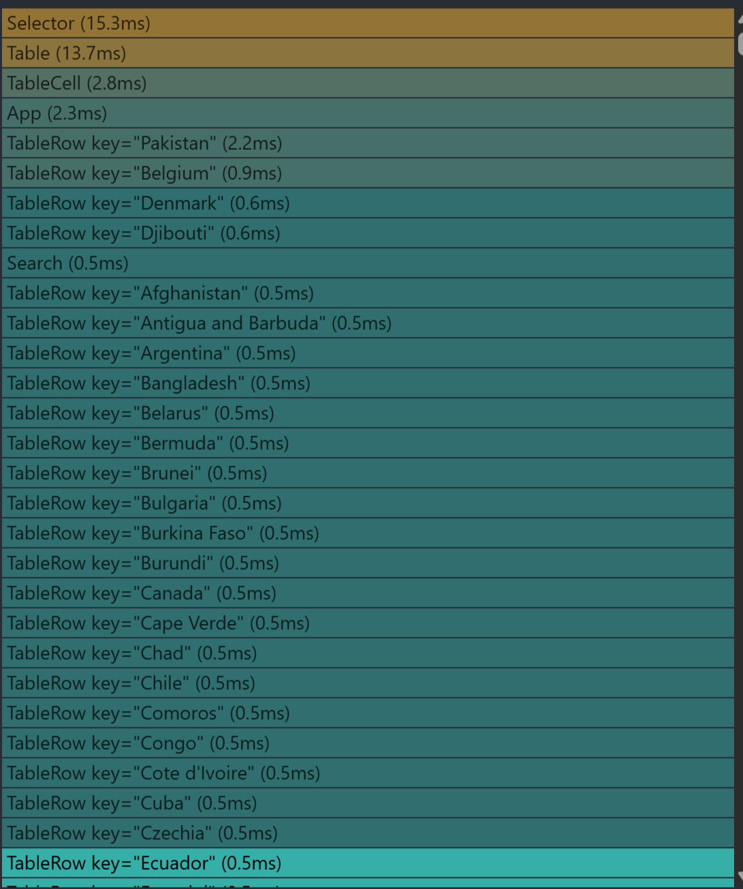

# First render (before receiving the data)

| Before                                                                                                |                       After                       |
| :---------------------------------------------------------------------------------------------------- | :-----------------------------------------------: |
|                                                     |  |
| **Render**: 21.9ms **Committed at:** 0.7s **Passive effects**: 1s **Layout effects**: <0.1ms |                         -                         |

# Rerender after receiving data

| Before                                                                                                 |                   After                    |
| :----------------------------------------------------------------------------------------------------- | :----------------------------------------: |
|                                                             |  |
| **Render**: 264.5ms **Committed at:** 1s **Passive effects**: 33.6s **Layout effects**: 0.3ms |                     -                      |

# Use sorting

| Before                                                                                                     |                  After                   |
| :--------------------------------------------------------------------------------------------------------- | :--------------------------------------: |
|                                                                    |  |
| **Render**: 225.5ms **Committed at:** 2.3s **Passive effects**: 29.2ms **Layout effects**: <0.1ms |                    -                     |

# Use filter year

| Before                                                                                                     |                      After                      |
| :--------------------------------------------------------------------------------------------------------- | :---------------------------------------------: |
|                                                            |  |
| **Render**: 241.2ms **Committed at:** 2.9s **Passive effects**: 55.2ms **Layout effects**: <0.1ms |                        -                        |

# Use search (value = "f" )

| Before                                                                                                     |                    After                    |
| :--------------------------------------------------------------------------------------------------------- | :-----------------------------------------: |
|                                                                |  |
| **Render**: 226.4ms **Committed at:** 2.8s **Passive effects**: 28.9ms **Layout effects**: <0.1ms |                      -                      |

# Add new column for table

| Before                                                                                                   |                   After                   |
| :------------------------------------------------------------------------------------------------------- | :---------------------------------------: |
|                                                                |  |
| **Render**: 211.6ms **Committed at:** 0.8s **Passive effects**: 27ms **Layout effects**: <0.1ms |                     -                     |
